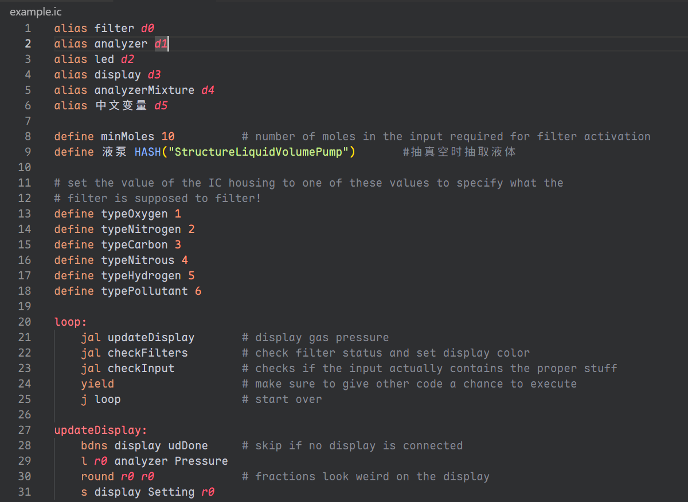
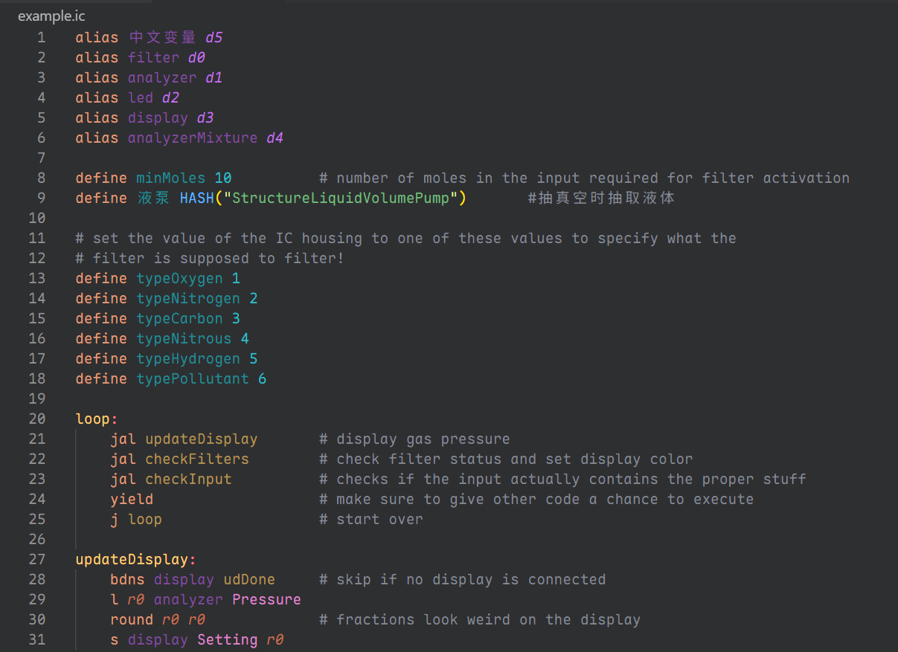
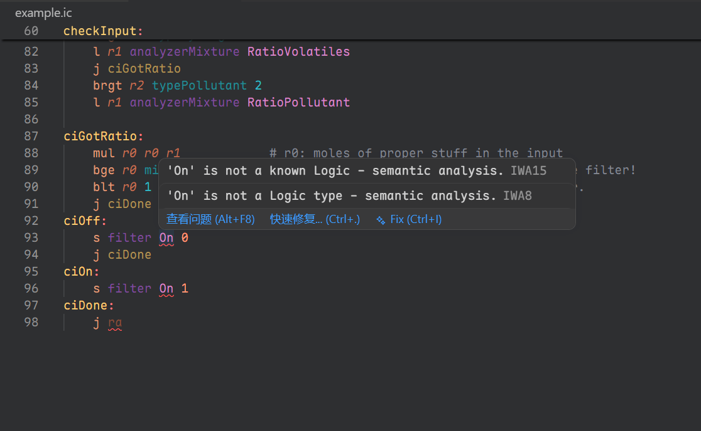
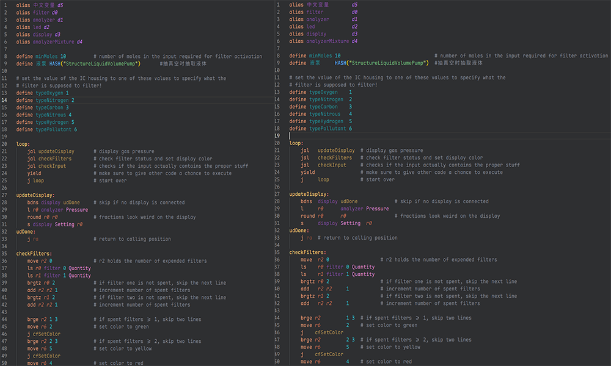
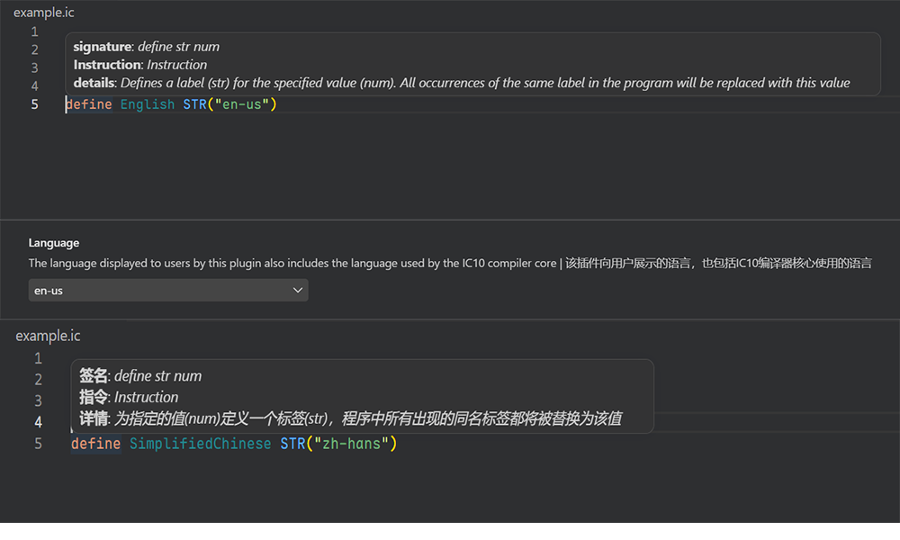

<div align="center">
  
</div>

# IC10 Language Support

[](https://creativecommons.org/licenses/by-nc-sa/4.0/)

<details>
   <summary>中文版</summary>

IC10 是游戏 [Stationeers](https://store.steampowered.com/app/544550/Stationeers/) 中可编程逻辑芯片（IC10）所使用的汇编风格脚本语言。本扩展为其提供完整的 VS Code 语言支持。

该扩展基于 **C++ 原生编译器核心**，通过 Node.js 绑定与 VS Code 集成，在保证解析精度的同时兼顾编辑性能。编译器核心实现了完整的词法分析、语法分析、语义分析与增量编译流水线，为大文件的实时编辑提供近零延迟的响应体验。

## 特性

### 1. 语法高亮
基于 TextMate 语法的高亮规则，覆盖关键字、寄存器、设备引用、字符串、数字、注释等。



### 2. 语义高亮
基于编译器符号表的语义级着色：
- 寄存器别名与原生寄存器区分着色
- 设备别名与原生设备引用区分着色
- `define` 常量与原始数字字面量区分着色
- 标签、宏调用（`HASH`/`STR`）、类型注解等独立着色
- 词素按声明/引用状态赋予不同修饰符



### 3. 实时诊断
编译器在每次编辑后增量分析代码，即时报告词法、语法与语义错误，并在问题面板中分类展示。



> [!NOTE]
> 由于 IC10 没有公开的官方语言规范，编译器行为基于 Stationeers 游戏实际运行验证。对于未覆盖的边缘情况，欢迎在 [Issues](https://github.com/edoCsItahW/Stationeers/issues) 中反馈。

### 4. 悬停提示
悬停在任意符号（别名、标签、常量、指令关键字）上时，显示其类型、值、描述等详细信息。

<video src="./static/hover.mp4"  style="padding: 20px;"></video>


### 5. 智能补全
- 指令关键字补全（支持前缀匹配）
- 操作数补全：根据当前指令的操作数类型约束（`typeN`），自动筛选寄存器、设备引用、枚举值、跳转标签
- 设备上下文感知：根据前置设备节点过滤对应的 `LogicType`/`LogicSlot`/`BatchMode`/`SlotIndex`
- `alias` / `define` 专用补全

<video src="./static/completion.mp4" style="padding: 20px;"></video>

### 6. 函数签名帮助
输入空格或逗号后，显示当前指令的参数签名与各操作数位置，标记当前正在输入的参数。

<video src="./static/signature.mp4"  style="padding: 20px;"> </video>

### 7. 代码格式化
支持从项目根 `.ic.yaml`、`.ic.yml` 或 `.ic.json` 读取格式化配置。支持的规则：
- 连续 `alias` / `define` 按列对齐
- 行尾注释同组内对齐，与代码间隔可配置
- 标签下指令统一缩进（默认 4 空格或 Tab）
- 连续空行压缩到可配置的最大值
- 标签前可配置最小空行数
- 激进模式：同标签作用域内指令操作数按列对齐



> [!TIP]
> 若代码中包含 Unicode 字符（如中文注释、特殊符号），请确保编辑器使用等宽字体，否则格式化后的对齐效果可能发生偏移。

### 8. 增量编译
编译流水线实现了行级增量词法分析与语句级增量语法分析。仅重新分析受编辑影响的行，大幅降低大文件的编辑延迟。增量缓存跨编辑会话保持，避免每次打开文件时的全量解析。

### 9. 双语支持
支持英语（en-us）和简体中文（zh-hans），覆盖编译诊断、悬停提示、补全文档等所有界面文本。切换语言即时生效。



### 10. 类型注解语法
支持通过特殊尾随注释语法为别名标注类型信息：
```
alias myDevice d0  #: @type DeviceType
```
编译器根据注解推断操作数类型，提供更精确的补全和诊断。类型提示使用 `#:` 前缀，后续可跟 `@type`、`@desc` 等标签。

> [!NOTE]
> 编译器内置了标准库（[stdLib.ic](https://github.com/edoCsItahW/Stationeers/blob/develop/code/backend/compiler/tests/stdLib.ic)），定义了常见设备的类型、逻辑槽位、批处理模式等枚举。但由于游戏中设备种类繁多，标准库目前仅覆盖了部分设备。若您的项目使用了尚未纳入标准库的设备类型，欢迎向标准库仓库贡献。标准库使用特殊的文档注释语法（`#>`）定义枚举和设备类型，例如：
> ```
> #> @device
> #> @name MyDevice
> #> @desc ./locals/enums.MyDevice.desc
> #> @value ModeA 0 ./locals/enums.MyDevice.enums.ModeA.desc
> #> @value ModeB 1 ./locals/enums.MyDevice.enums.ModeB.desc
> #> @end-device
> ```

## 依赖

- **VS Code** `^1.125.0`
- **Node.js** 运行时（VS Code 内建，无需单独安装）

## 扩展设置

设置位置：`文件 > 首选项 > 设置 > 扩展 > IC10 Language Support`

- `ic10.language`：界面语言，默认 `"en-us"`，可选 `"zh-hans"`。切换后即时生效。

- `ic10.format.useTab`：使用 Tab 缩进，默认 `false`。为 `true` 时忽略 `indentWidth`。

- `ic10.format.indentWidth`：每级缩进空格数，默认 `4`。

- `ic10.format.spacesBeforeTrailingComments`：行尾注释前的空格数，默认 `2`。

- `ic10.format.maxEmptyLinesToKeep`：保留的最大连续空行数，默认 `1`。

- `ic10.format.minEmptyLinesBeforeLabels`：标签前的最小空行数，`0` 表示无限制，默认 `0`。

- `ic10.format.alignConsecutiveStatements`：连续同类语句按列对齐，默认 `true`。

- `ic10.format.alignTrailingComments`：同组内行尾注释对齐，默认 `true`。

> [!TIP]
> 格式化配置也可通过项目根目录下的 `.ic.json`、`.ic.yaml` 或 `.ic.yml` 文件指定，格式参考 [参考模板]()。

## 已知问题

1. **大文件性能**：虽然增量编译大幅降低了编辑延迟，但在首次打开超大文件时（数千行），全量解析仍需一定时间。

## 待办事项

- 编译器
    - [ ] 完善标准库，覆盖更多设备类型
    - [ ] 链接器增量支持，进一步降低声明式编辑的延迟

- IDE
    - [ ] 添加跳转定义 / 查找引用
    - [ ] 添加重命名符号

## 发布说明

这是 1.0.0 版本的发布说明。

首个正式版本，完成了 IC10 编译器的全量开发：词法分析器、语法分析器、语义分析器与链接器均已通过语料测试。IDE 支持涵盖语法高亮、语义高亮、实时诊断、悬停提示、智能补全、签名帮助、代码格式化等完整的编辑体验。增量编译流水线为日常编辑提供近零延迟的性能表现。

由于 IC10 没有公开的官方语言规范，编译器行为基于 Stationeers 游戏实际运行验证。对于未覆盖的边缘情况，欢迎在 [Issues](https://github.com/edoCsItahW/Stationeers/issues) 中反馈。

</details>

---

IC10 is the assembly-style scripting language used by programmable logic chips (IC10) in the game [Stationeers](https://store.steampowered.com/app/544550/Stationeers/). This extension provides full VS Code language support for `.ic` and `.ic10` files.

The extension is powered by a **C++ native compiler core**, integrated with VS Code via Node.js bindings, delivering both parsing precision and editing performance. The compiler core implements a complete pipeline of lexical analysis, syntax analysis, semantic analysis, and incremental compilation, providing near-zero latency for real-time editing of large files.

## Features

### 1. Syntax Highlighting
TextMate-based grammar covering keywords, registers, device references, strings, numbers, and comments.


### 2. Semantic Highlighting
Compiler symbol-table-driven semantic coloring:
- Register aliases visually distinguished from native registers
- Device aliases distinguished from native device references
- `define` constants distinguished from raw numeric literals
- Labels, macro calls (`HASH`/`STR`), and type annotations each have independent colors
- Tokens carry declaration/reference modifiers for fine-grained theming


### 3. Real-time Diagnostics
The compiler incrementally re-analyzes code on every edit, instantly reporting lexical, syntax, and semantic errors categorized in the Problems panel.


> [!NOTE]
> As IC10 has no publicly available official language specification, compiler behavior is validated against Stationeers' actual in-game execution. For uncovered edge cases, feedback is welcome in [Issues](https://github.com/edoCsItahW/Stationeers/issues).

### 4. Hover Tooltips
Hovering over any symbol (alias, label, constant, instruction keyword) displays its type, value, description, and other details.

<video src="./static/hover.mp4"  style="padding: 20px;"></video>

### 5. Intelligent Completion
- Instruction keyword completion with prefix matching
- Operand completion: automatically filters registers, device references, enum values, and jump targets based on the current instruction's operand type constraints (`typeN`)
- Device context awareness: filters `LogicType`/`LogicSlot`/`BatchMode`/`SlotIndex` based on the preceding device node
- Specialized `alias` / `define` directive completion

<video src="./static/completion.mp4" style="padding: 20px;"></video>

### 6. Function Signature Help
Displays the current instruction's parameter signature and operand positions after typing a space or comma, highlighting the active parameter.

<video src="./static/signature.mp4"  style="padding: 20px;"> </video>

### 7. Code Formatting
Supports configuration from `.ic.yaml`, `.ic.yml`, or `.ic.json` in the project root. Formatting rules:
- Consecutive `alias` / `define` column alignment
- Trailing comment alignment within groups, with configurable code-comment spacing
- Uniform indentation for instructions under labels (default 4 spaces or Tab)
- Consecutive empty line compression to configurable maximum
- Configurable minimum empty lines before labels
- Aggressive mode: instruction operand column alignment within the same label scope


> [!TIP]
> If your code contains Unicode characters (e.g., Chinese comments or special symbols), ensure that the editor uses a monospaced font; otherwise, the alignment effect of formatting may be skewed.

### 8. Incremental Compilation
The compilation pipeline implements line-level incremental lexical analysis and statement-level incremental parsing. Only lines affected by an edit are re-analyzed, dramatically reducing editing latency for large files. Incremental caches persist across editing sessions, avoiding full re-parsing on file open.

### 9. Bilingual Support
English (en-us) and Simplified Chinese (zh-hans), covering all interface text including compiler diagnostics, hover tooltips, and completion documentation. Language changes take effect immediately.


### 10. Type Annotation Syntax
Annotate aliases with type information using special comment syntax:
```
alias myDevice d0  #: @type DeviceType
```
The compiler infers operand types from annotations, providing more precise completions and diagnostics. Type hints use the `#:` prefix and support tags such as `@type` and `@desc`.

> [!NOTE]
> The compiler ships with a built-in standard library ([stdLib.ic](https://github.com/edoCsItahW/Stationeers/blob/develop/code/backend/compiler/tests/stdLib.ic)) that defines enumerations for common device types, logic slots, batch modes, and more. However, given the vast number of in-game devices, the standard library currently covers only a subset. If your project uses device types not yet in the standard library, contributions are welcome. The standard library uses a special documentation comment syntax (`#>`) to define enumerations and device types, for example:
> ```
> #> @enum
> #> @name MyDevice
> #> @desc ./locals/enums.MyDevice.desc
> #> @value ModeA 0 ./locals/enums.MyDevice.enums.ModeA.desc
> #> @value ModeB 1 ./locals/enums.MyDevice.enums.ModeB.desc
> #> @end-enum
> ```

## Requirements

- **VS Code** `^1.125.0`
- **Node.js** runtime (bundled with VS Code, no separate installation needed)

> [!NOTE]
> The extension's C++ compiler core (compiled to a Node.js native addon) is pre-built and bundled in `server/node_modules/ic10-node-api`. No external build toolchain is required.

## Extension Settings

Location: `File > Preferences > Settings > Extensions > IC10`

- `ic10.language`: UI language, default `"en-us"`. Options: `"zh-hans"`. Changes take effect immediately.

- `ic10.format.useTab`: Use Tab for indentation, default `false`. When `true`, `indentWidth` is ignored.

- `ic10.format.indentWidth`: Spaces per indentation level, default `4`.

- `ic10.format.spacesBeforeTrailingComments`: Spaces before trailing comments, default `2`.

- `ic10.format.maxEmptyLinesToKeep`: Maximum consecutive empty lines to keep, default `1`.

- `ic10.format.minEmptyLinesBeforeLabels`: Minimum empty lines before labels, `0` means no restriction, default `0`.

- `ic10.format.alignConsecutiveStatements`: Align consecutive statements of the same type by column, default `true`.

- `ic10.format.alignTrailingComments`: Align trailing comments within the same group, default `true`.

> [!TIP]
> Formatting configuration can also be specified via a `.ic.json`, `.ic.yaml`, or `.ic.yml` file in the project root. See the [reference template]() for the schema.

## Known Issues

1. **Large File Performance**: While incremental compilation significantly reduces editing latency, the initial full parse for very large files (thousands of lines) still takes a noticeable amount of time.

## Todo

- Compiler
    - [ ] Expand standard library coverage for more device types
    - [ ] Incremental linker support to further reduce latency for declarative edits

- IDE
    - [ ] Add go-to-definition / find-references
    - [ ] Add rename symbol

## Release Notes

This is the release note for version 1.0.0.

The first stable release, featuring a complete IC10 compiler pipeline: lexer, parser, semantic analyzer, and linker, all validated through corpus testing. IDE support covers the full editing experience: syntax highlighting, semantic highlighting, real-time diagnostics, hover tooltips, intelligent completion, signature help, and code formatting. The incremental compilation pipeline delivers near-zero latency for day-to-day editing.

As IC10 has no publicly available official language specification, compiler behavior is validated against Stationeers' actual in-game execution. For uncovered edge cases, feedback is welcome in [Issues](https://github.com/edoCsItahW/Stationeers/issues).
